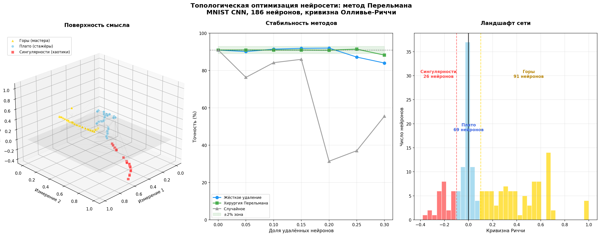
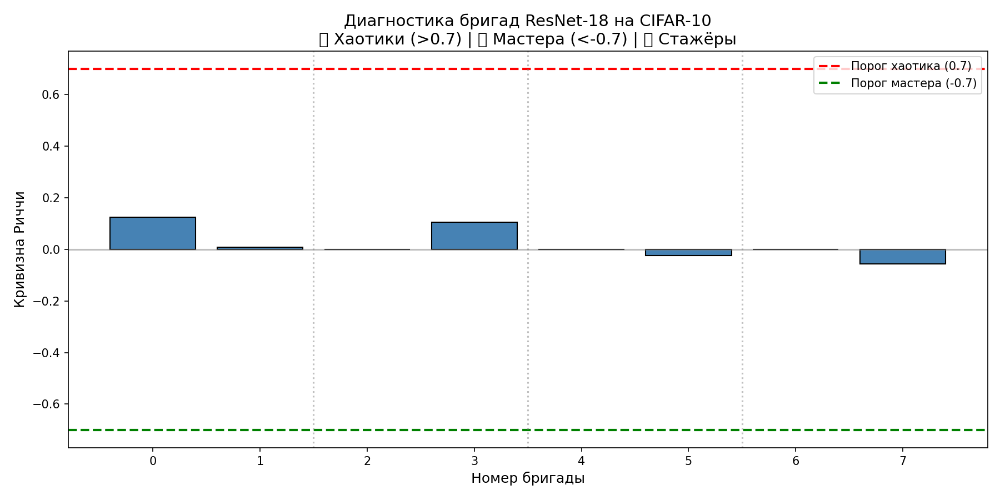

# BrainTopologyLLM

**Топологическая оптимизация нейросетей через кривизну Риччи и хирургию Перельмана**

## Идея

Григорий Перельман доказал, что любое трёхмерное многообразие можно сгладить до сферы, вырезая сингулярности и вклеивая "стандартные колпачки". Мы применяем эту логику к нейросетям: нейроны образуют поверхность смысла, кривизна Риччи показывает, где горы (мастера), плато (стажёры) и сингулярности (хаотики). Вместо удаления лишнего мы заменяем хаотичное на стабильное.

## Результаты (MNIST CNN, 186 нейронов)

### Ландшафт сети

- **91 гора (мастера)** — стабильные нейроны, нельзя трогать
- **69 плато (стажёры)** — дублируют друг друга, можно удалять
- **26 сингулярностей (хаотики)** — шумят, их нужно заменять, а не удалять

### Сравнение методов

| Метод | Макс. pruning | Характер |
|-------|---------------|----------|
| **Хирургия Перельмана** | 30% | Стабильная, предсказуемая |
| Жёсткое удаление | 20% | То взлетает, то падает |
| Случайное | 0% | Хаос |

- Хирургия сохраняет точность выше baseline даже при 25% pruning (91.46% vs 90.98%)
- Жёсткое удаление нестабильно: при 20% даёт 92%, при 25% падает до 87%
- Хирургия побеждает жёсткое удаление при глубоком pruning (25-30%)

### Ключевой вывод

> Удаление нейронов — это русская рулетка. Замена сингулярностей на среднее соседей (колпачки Перельмана) — это стабильная оптимизация.

## Визуализация



*Ландшафт полносвязной сети MNIST: горы (мастера), плато (стажёры), сингулярности (хаотики)*

## Новости

### 8 июня 2026: Хирургия Перельмана на повреждённом ResNet

Проведена серия экспериментов с искусственно ослабленными skip-соединениями (коэффициенты 0.7, 0.5, 0.3). BatchNorm удалён для усиления эффекта.

**Результаты:**

| skip | исходная Acc | финальная Acc | эффект | заменено сингулярностей |
|------|--------------|---------------|--------|-------------------------|
| 0.7  | 39.8%        | 44.6%         | +4.8 п.п. | ~320 |
| 0.5  | 33.3%        | 44.0%         | +10.7 п.п.| 516 |
| 0.3  | 27.3%        | 44.1%         | +16.8 п.п.| ~400 |

**Ключевые выводы:**
- Чем хуже исходное состояние сети (ниже skip, ниже accuracy), тем выше эффект от хирургии.
- После операции все сети сошлись к единой точности (~44%) независимо от стартовых повреждений.
- Финальное количество сингулярностей (160–180) одинаково для всех вариантов.

**Код эксперимента:** `experiments/broken_resnet/run_experiments.py`

### 6 июня 2026: ResNet эксперимент завершён

Проведена диагностика ResNet-18 на CIFAR-10 после 10 эпох разогрева.

**Результат:** 0 сингулярностей из 8 бригад. Все бригады показали кривизну около нуля, что соответствует статусу "стажёр". Skip-соединения естественным образом стабилизируют сеть, хирургия не потребовалась. Baseline точность: 78.6%.



*Диагностика 8 бригад ResNet-18: все бригады в зоне стажёров (кривизна около нуля)*

### 5 июня 2026: Первая хирургия Перельмана

На полносвязной сети MNIST (186 нейронов) впервые применена хирургия Перельмана. Выявлено 26 сингулярностей (14% нейронов). Замена хаотиков на среднее мастеров показала стабильность при pruning до 30%, что превосходит жёсткое удаление.

## Сравнение архитектур

| Архитектура | Сингулярности | Статус |
|-------------|---------------|--------|
| MNIST (полносвязная) | 26 из 186 (14%) | Хирургия работает |
| ResNet-18 (skip connections) | 0 из 8 (0%) | Хирургия не требуется |
| GPT-2 (трансформер) | Исследуется | Следующий шаг |

## Структура проекта

brain_topology_llm/
├── src/
│   ├── mnist_ricci_pipeline.py
│   ├── compare_pruning.py
│   ├── perelman_surgery.py
│   ├── resnet_archetype_surgery.py
│   ├── checkpoint_manager.py
│   ├── train_cifar_resnet.py
│   ├── landscape.py
│   └── load_controller.py
├── results/
├── checkpoints/
├── data/
├── README.md
└── .gitignore

## Быстрый старт

Создание окружения и установка зависимостей:

```bash
python3.10 -m venv venv_brain
source venv_brain/bin/activate
pip install torch torchvision networkx GraphRicciCurvature numpy matplotlib scikit-learn tqdm psutil

Запуск MNIST эксперимента:
bash

python src/perelman_surgery.py

Запуск ResNet эксперимента:
bash

python src/resnet_archetype_surgery.py

Принудительный перезапуск (с удалением чекпоинтов):
bash

python src/resnet_archetype_surgery.py --force_restart

Что дальше

    MNIST + хирургия Перельмана (завершено)

    CIFAR-10 + ResNet (завершено: сингулярностей нет)

    GPT-2 + хирургия внутренних слоёв (в процессе)

    Сжатие промптов через топологию токенов

    Multi-seed validation и статистическая значимость

Философия проекта

Перельман показал, что любую сложную форму можно упростить, заменяя проблемные участки на стандартные. Та же логика работает с нейросетями: вместо того чтобы удалять "шумные" нейроны (что похоже на русскую рулетку), мы заменяем их на усреднённые, стабильные версии.
Лицензия

MIT
